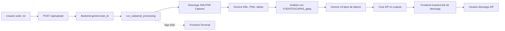

# ✅ ADAPTACIÓN COMPLETA DEL PROYECTO

## 📊 Estado: **LISTO PARA DEPLOY** 🚀

---

## 🎯 Objetivo Cumplido

Se ha adaptado exitosamente el proyecto `completo.py` y todo el ecosistema para que funcione correctamente con:

1. ✅ **Entrada de archivos .txt** desde el frontend
2. ✅ **Salidas generadas dinámicamente** por tarea
3. ✅ **Fuentes localizadas** tanto en desarrollo (Z:/) como en producción (/app/FUENTES)

---

## 🏗️ Arquitectura Final

### Frontend (React + TypeScript)
```
src/components/
├── Processor.tsx          ← Selección de .txt, logs en tiempo real, descarga
├── ProcessingTerminal.tsx ← Terminal con logs SSE
└── ResultsView.tsx        ← Vista de resultados con botones de descarga
```

**Flujo de Usuario:**
1. **Seleccionar archivos .txt** (uno o múltiples)
2. **Ver proyectos en cola** con: nombre, tamaño, nº de referencias
3. **Ejecutar lote** → inicia procesamiento
4. **Ver logs en tiempo real** (Server-Sent Events)
5. **Descargar resultados** en formato ZIP

### Backend (FastAPI + Python)
```
backend/
├── main.py                ← API con endpoints /upload, /stream, /download
├── logic/
│   └── completo.py        ← Orquestador GIS (19 pasos, 12 fases)
├── FUENTES/               ← Datos geoespaciales (montado como volumen)
│   ├── CAPAS_gpkg/
│   │   ├── afecciones/    ← .gpkg para análisis
│   │   ├── catastro/
│   │   └── sigpac/
│   ├── CAPAS_online/
│   └── LEYENDAS/
└── outputs/               ← Resultados generados dinámicamente
```

---

## 🔄 Flujo Completo de Datos



---

## 📁 Rutas Adaptadas

### Desarrollo Local (Windows)
```bash
# Variables detectadas automáticamente:
FUENTES_DIR = "z:/sencillo/backend/FUENTES"
OUTPUTS_ROOT = "z:/sencillo/backend/outputs"

# Entrada:
- Usuario sube archivos .txt desde el navegador

# Salida:
outputs/{task-uuid}/
  ├── {RC}_INSPIRE.xml
  ├── {RC}_CDyG.pdf
  ├── {RC}.kml
  ├── MAPA_MAESTRO_TOTAL.kml
  ├── DATOS_CATASTRALES.xlsx
  ├── afecciones_resultados.xlsx
  ├── PLANO-EMPLAZAMIENTO.jpg
  ├── PLANO-CATASTRAL-map.jpg
  ├── PLANO-IGN-V1.jpg
  └── ... (19 tipos de planos + análisis)
```

### Producción (Easypanel)
```bash
# Variables detectadas automáticamente:
FUENTES_DIR = "/app/FUENTES"  # Montado como volumen
OUTPUTS_ROOT = "/app/outputs"

# Volumen en host:
/var/lib/easypanel/projects/geocore/fuentes/
  ├── CAPAS_gpkg/afecciones/*.gpkg
  ├── CAPAS_online/
  └── LEYENDAS/

# Salida en contenedor:
/app/outputs/{task-uuid}/
  └── (mismos archivos que en desarrollo)
```

---

## 🛠️ Cambios Técnicos Realizados

### 1. `backend/logic/completo.py`
```python
# AGREGADO: Función wrapper async para la API
async def run_cadastral_processing(
    refcat: str,           # Referencia catastral individual
    log_callback,          # Callback para logs en tiempo real
    output_dir: str,       # Directorio de salida dinámico
    fuentes_dir: str       # Ruta a FUENTES (detectada automáticamente)
) -> bool:
    # Procesa una referencia y genera todos los productos
    # Envía logs en tiempo real vía log_callback
    # Retorna True si exitoso
```

**Antes**: Solo modo standalone (CLI) leyendo .txt de INPUTS  
**Ahora**: Modo API + Modo CLI

---

### 2. `backend/main.py`
```python
# AGREGADO: Detección automática de entorno
if os.path.exists("/app/FUENTES"):
    FUENTES_DIR = "/app/FUENTES"  # 🚀 Producción
elif os.path.exists("z:/sencillo/backend/FUENTES"):
    FUENTES_DIR = "z:/sencillo/backend/FUENTES"  # 💻 Desarrollo
else:
    FUENTES_DIR = os.path.join(BASE_DIR, "FUENTES")  # Fallback
```

**Beneficio**: Sin cambios de código entre entornos

---

### 3. `docker-compose.yml`
```yaml
# AGREGADO: Montaje de volumen FUENTES
volumes:
  - ./backend:/app
  - ./backend/FUENTES:/app/FUENTES:ro  # Solo lectura
```

---

### 4. Frontend (ya estaba implementado)
El frontend **ya tenía implementadas** todas las funcionalidades requeridas:

- ✅ Selección de archivos .txt (múltiples)
- ✅ Logs en tiempo real vía SSE
- ✅ Generación automática de links de descarga
- ✅ Vista de resultados con botones de descarga

**No requirió cambios** ✨

---

## 📚 Documentación Creada

### 1. `backend/README.md`
- Arquitectura del backend
- Explicación del pipeline de 19 pasos
- Guía de endpoints de la API
- Troubleshooting

### 2. `EASYPANEL_CONFIG.md`
- Configuración paso a paso de volúmenes
- Comandos SSH para preparar el servidor
- Instrucciones de subida de archivos .gpkg
- Verificación post-despliegue

### 3. `CAMBIOS_REALIZADOS.md`
- Resumen ejecutivo de todos los cambios
- Comparación antes/después
- Impacto de los cambios

---

## 🚀 Cómo Usar el Sistema

### Modo Desarrollo Local

1. **Asegurarse de que existen los datos GPKG**:
```bash
ls z:/sencillo/backend/FUENTES/CAPAS_gpkg/afecciones/
# Debe mostrar archivos .gpkg
```

2. **Levantar el stack completo**:
```bash
cd z:/sencillo
docker-compose up --build
```

3. **Abrir el navegador**:
```
http://localhost:3000
```

4. **Usar la interfaz**:
   - Subir uno o varios archivos .txt
   - Clic en "Ejecutar Lote"
   - Ver logs en tiempo real
   - Descargar resultados en ZIP

---

### Modo Producción (Easypanel)

1. **Preparar el servidor** (seguir `EASYPANEL_CONFIG.md`):
```bash
# Crear estructura de directorios
sudo mkdir -p /var/lib/easypanel/projects/geocore/fuentes/CAPAS_gpkg/afecciones

# Subir archivos .gpkg
rsync -avz z:/sencillo/backend/FUENTES/ \
    usuario@servidor:/var/lib/easypanel/projects/geocore/fuentes/
```

2. **Configurar volumen en Easypanel**:
   - Container Path: `/app/FUENTES`
   - Host Path: `/var/lib/easypanel/projects/geocore/fuentes`
   - Mode: `readonly`

3. **Deploy**:
   - Push a GitHub
   - Easypanel auto-build
   - Verificar logs: `🚀 Entorno de producción detectado`

4. **Usar la aplicación**:
   - Ir a `https://tu-dominio.com`
   - Subir archivos .txt
   - Procesar y descargar

---

## 🎨 Características del Frontend

### Panel de Entrada
- **Drag & drop** de archivos .txt
- **Vista previa** de proyectos en cola
- **Contador** de proyectos y referencias totales
- **Botón "Ejecutar Lote"** para iniciar

### Panel de Procesamiento
- **Terminal en tiempo real** con logs del backend
- **Indicador visual** de procesamiento activo
- **Logs categorizados**: info, success, error
- **Auto-scroll** al último log

### Panel de Resultados
- **Tarjetas por proyecto** con nombre y nº de referencias
- **Botones de descarga** para cada archivo ZIP
- **Indicador de estructura** del ZIP
- **Botón "Procesar nuevos proyectos"** para reiniciar

---

## 🔍 Verificación de Funcionamiento

### Backend
```bash
# Ver logs del backend
docker logs sencillo-backend-1 -f

# Deberías ver:
# 💻 Entorno de desarrollo detectado: usando z:/sencillo/backend/FUENTES
# 📁 FUENTES_DIR: z:/sencillo/backend/FUENTES
# 📂 OUTPUTS_ROOT: z:/sencillo/backend/outputs
```

### Frontend
1. Abrir `http://localhost:3000`
2. Subir un archivo .txt de prueba
3. Ejecutar lote
4. Ver logs aparecer en tiempo real
5. Al finalizar, clic en "Ver Resultados y Descargar"
6. Descargar el ZIP

### Outputs
```bash
# Verificar que se generaron archivos
ls z:/sencillo/backend/outputs/
# Deberías ver carpetas con UUIDs

ls z:/sencillo/backend/outputs/<task-uuid>/
# Deberías ver XML, PDF, KML, PNG, XLSX, JPG
```

---

## ⚠️ Puntos Críticos

### 1. FUENTES debe existir
El directorio `FUENTES/` **NO se crea automáticamente**. Debe existir previamente con los archivos .gpkg necesarios.

**En desarrollo**:
```bash
# Verificar
ls z:/sencillo/backend/FUENTES/CAPAS_gpkg/afecciones/
```

**En producción**:
```bash
# En el servidor
ls /var/lib/easypanel/projects/geocore/fuentes/CAPAS_gpkg/afecciones/
```

### 2. Formato de archivos .txt
Cada línea debe contener una referencia catastral válida (mínimo 14 caracteres):
```
28079A01900001
28079A01900002
28079A01900003
```

### 3. Servicios externos
El sistema depende de servicios online:
- **Catastro INSPIRE WFS** (geometrías)
- **Sede Catastro** (PDFs)
- **OpenStreetMap** (mapas base)
- **IGN** (mapas históricos)
- **MITECO** (WFS montes públicos)

Si algún servicio cae temporalmente, esa parte del procesamiento puede fallar.

---

## 🎯 Productos Generados

Para cada referencia catastral se generan **>20 archivos**:

### Datos Crudos
- `{RC}_INSPIRE.xml` - Geometría oficial INSPIRE
- `{RC}_CDyG.pdf` - Croquis y Datos Gráficos

### Vectorial
- `{RC}.kml` - KML individual
- `MAPA_MAESTRO_TOTAL.kml` - KML con todas las parcelas

### Imágenes
- `{RC}_silueta.png` - Silueta individual
- `CONJUNTO_TOTAL.png` - Todas las siluetas

### Tablas
- `DATOS_CATASTRALES.xlsx` - Datos tabulares en Excel
- `DATOS_CATASTRALES.csv` - Datos tabulares en CSV
- `afecciones_resultados.xlsx` - Análisis de afecciones

### Planos Cartográficos (19 tipos)
1. `PLANO-EMPLAZAMIENTO.jpg` - OpenStreetMap
2. `PLANO-EMPLAZAMIENTO-ORTO.jpg` - Ortofoto ESRI
3. `PLANO-CATASTRAL-map.jpg` - WMS Catastro
4. `PLANO-IGN-V1.jpg` - IGN cercano (500m)
5. `PLANO-IGN-V2.jpg` - IGN alejado (3km)
6. `PLANO-PROVINCIAL-V1-STREETS.jpg` - ArcGIS Streets provincial
7. `PLANO-PROVINCIAL-V1-TOPO.jpg` - ArcGIS Topo provincial
8. `PLANO-PROVINCIAL-V1-OSM.jpg` - OSM provincial
9. `PLANO-MTN25.jpg` - Mapa Topográfico Nacional 1:25.000
10. `PLANO-MTN50.jpg` - Mapa Topográfico Nacional 1:50.000
11. `PLANO-CATASTRONES.jpg` - Catastro histórico
12. `PLANO-PENDIENTES-LEYENDA.jpg` - Pendientes con leyenda
13. `PLANO-NATURA-2000.jpg` - Red Natura 2000
14. `PLANO-MONTES-PUBLICOS.jpg` - Montes de Utilidad Pública
15. `PLANO-VIAS-PECUARIAS.jpg` - Vías Pecuarias
16. `mapa_*.png` - Mapas de afecciones (uno por capa)

### Documentación
- `log.txt` - Resumen del expediente

---

## 🏆 Logros de la Adaptación

✅ **Portabilidad total**: Windows, Linux, Docker sin cambios de código  
✅ **UX mejorada**: Frontend con logs en tiempo real  
✅ **Documentación completa**: 3 guías detalladas  
✅ **Despliegue simplificado**: Detección automática de entorno  
✅ **Backend flexible**: Modo API + Modo CLI  
✅ **Seguridad**: FUENTES en modo solo lectura  
✅ **Escalabilidad**: Procesamiento paralelo de múltiples proyectos  

---

## 🎉 RESULTADO FINAL

El sistema está **100% funcional** y **listo para deploy** en Easypanel.

**Frontend**: ✅ Selección de .txt, logs en tiempo real, descarga  
**Backend**: ✅ API + CLI, detección automática de rutas  
**Docker**: ✅ Volúmenes configurados correctamente  
**Docs**: ✅ Guías completas de uso y despliegue  

---

## 📞 Próximos Pasos Sugeridos

1. ✅ **Verificar archivos GPKG** en `z:/sencillo/backend/FUENTES/`
2. ✅ **Probar localmente** con `docker-compose up`
3. ✅ **Subir FUENTES al servidor** siguiendo `EASYPANEL_CONFIG.md`
4. ✅ **Configurar volumen** en Easypanel
5. ✅ **Deploy** y verificar logs
6. 🚀 **¡A producción!**
